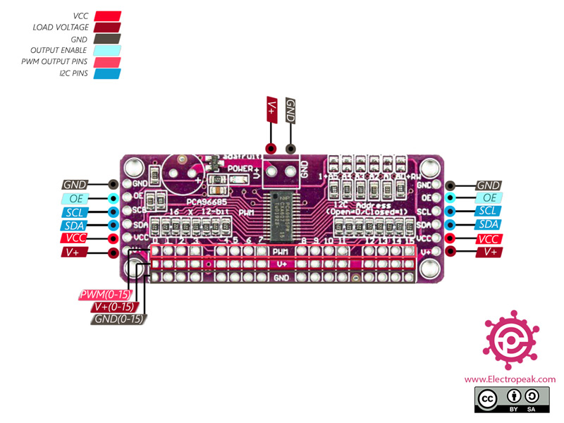

# rpi-arcade-lights

A program that lights up arcade buttons according to the buttons used in the game currently being played. This pairs up nicely with the custom [Arduino arcade controller](https://github.com/IgniparousTempest/rpi-arcade-controller-pro-micro) I made.

Before Retropie boots a game, it first runs a runcommand file. This script can be appended to that file.

[./rpi_button_lights.py](./rpi_button_lights.py) is the main file, [./test_lights.py](./test_lights.py) can be used to make sure your wiring is correct.

## Demo

https://user-images.githubusercontent.com/13403691/150954365-21222b36-9cbd-4a9c-9b7c-337bc19ffcb6.mp4

Alternatively, see on [Youtube](https://www.youtube.com/watch?v=wDSLc2lCGLs).

## Wiring

Adafruit PCA9685   |     |  Raspberry Pi
:-----------------:|:---:|:---------------:
GND                | --> | GND
OE                 | --> | 
SCL                | --> | 5
SDA                | --> | 3
VCC                | --> | 3V3

### Raspberry Pi Pinout

### Adafruit PCA9685

## Installation

1. Enable I2C:

You will probably get this error `ValueError: No Hardware I2C on (scl,sda)=(3, 2)`. So we need to enable I2C via `sudo raspi-config` > Interface Options > I2C.

2. Reboot the Pi
3. Run the following commands:

    # Main file
    pip3 install -r requirements.txt
    cp rpi_button_lights.py /usr/local/bin/
    cd /usr/local/bin/
    chmod a+x rpi_button_lights.py
    cd -
    
    # Database
    cp rpi_button_lights_database.csv /usr/local/etc/
    
    # Game launch script
    cp event_hook_scripts/runcommand-onstart.sh /opt/retropie/configs/all
    cd /opt/retropie/configs/all
    chmod a+x runcommand-onstart.sh
    cd -
    
    # Game quit script
    cp event_hook_scripts/runcommand-onend.sh /opt/retropie/configs/all
    cd /opt/retropie/configs/all
    chmod a+x runcommand-onend.sh
    cd -
    
    # Arcade shutdown script
    mkdir ~/.emulationstation/scripts
    mkdir ~/.emulationstation/scripts/quit
    cp event_hook_scripts/rpi_arcade_lights_quit.sh ~/.emulationstation/scripts/quit
    cd ~/.emulationstation/scripts/quit
    chmod a+x rpi_arcade_lights_quit.sh

## Adding new games

Find button configurations by Google Image searching: [<game name> controls site:gamesdatabase.org](https://www.google.com/search?tbm=isch&q=pole%20position%20controls%20site:gamesdatabase.org).

Add games as a new row in the [rpi_button_lights_database.csv](rpi_button_lights_database.csv) file.
